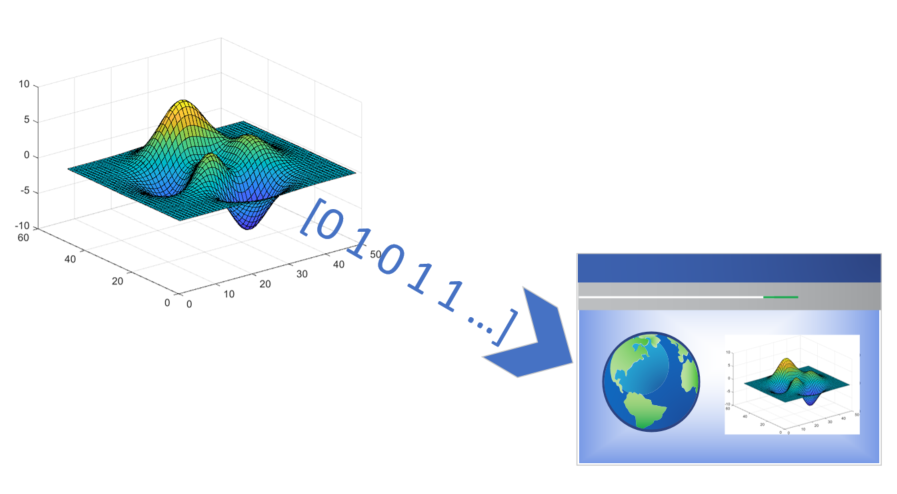

# Figure Deployer

This project provides a class to facilitate easy deployment of MATLAB figures to images or bytestreams.  

It's primarily meant to be used inside of a [MATLAB Production Server](https://www.mathworks.com/products/matlab-production-server.html) application to return static figures as images to the client.  However, it can also be useful for quick printing of figures when you have requirements around height, width, resolution and format.

See the documentation for examples and to get started.

